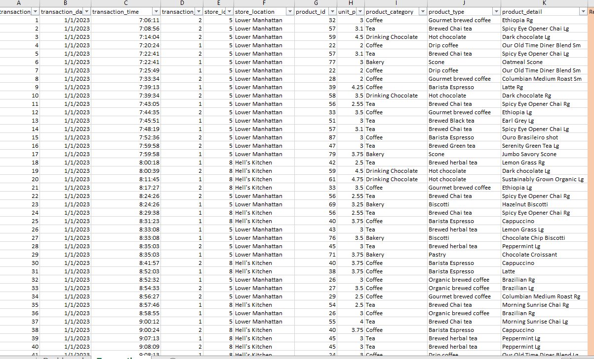
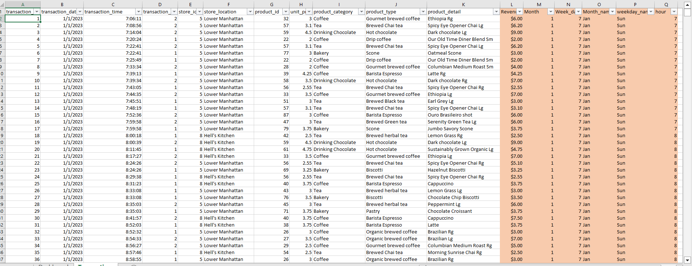
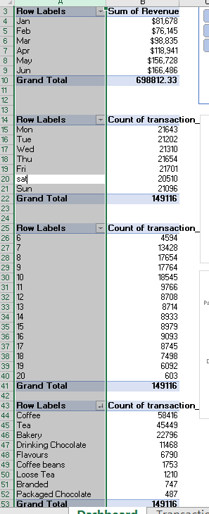
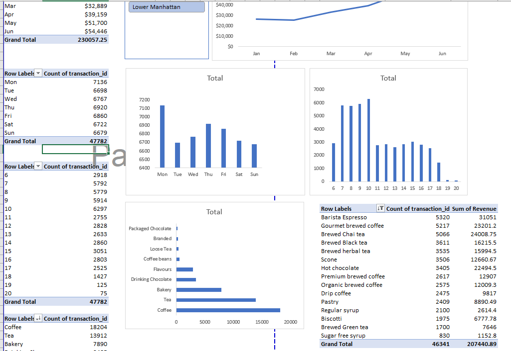

# Coffe_shop_sales

# Introduction/Project Overview
#### Objective: The objective of this project is to analyze transaction data from a coffee shop chain operating in three distinct locations: Lower Manhattan and Hell's Kitchen and Astoria. By examining the transaction details, we aim to uncover insights into customer preferences, popular products, peak transaction times, and differences between the three store locations. This analysis will inform strategic decisions related to inventory management, marketing strategies, and customer service enhancements.
# Data Source
#### The data is an Excel file: Coffee Shop Sales raw file.xlsx. It showcases a day-to-day detailed transaction records from 3 coffee shops in different location. The data covers transactions from January to June 2023. It including transaction IDs, dates, times, quantities, store locations, product IDs, unit prices, product categories, product types, and product details. 
## Data Description
####  The dataset comprises of transactions recorded on January 1, 2023, detailing the following attributes for each transaction:
-	**Transaction ID:** Unique identifier for each transaction.
-	**Transaction Date:** Date of the transaction.
-	**Transaction Time:** Time of the transaction.
-	**Transaction Quantity:** Number of units purchased in the transaction.
-	**Store ID:** Identifier for the store location.
- **Store Location:** Name of the store location.
- **Product ID:** Identifier for the product purchased.
-	**Unit Price:** Price per unit of the product.
-	**Product Category:** Broad category of the product (e.g., Coffee, Tea, Drinking Chocolate, Bakery).
-	**Product Type:** Specific type of the product within the category.
-**Product Detail:** Detailed description or variation of the product.

The dataset provides a comprehensive view of customer behavior and product preferences during a specific timeframe, offering valuable insights into operational and marketing strategies for the coffee shop chain.
## DATA COLLECTION AND PREPARATION

#### The above is showing the raw data used
## Problem Statement
#### The aim is to perform a comprehensive analysis of the sales data to identify patterns and trends that can help in understanding customer preferences and optimizing sales strategies. Specific areas of interest include:
1.	Sales Distribution: Analyze the distribution of sales throughout the morning to identify peak hours and low sales periods.
2.	Product Popularity: Determine the most and least popular products based on the quantity sold and revenue generated.
3.	Category Analysis: Compare the performance of different product categories (e.g., Coffee, Tea, Drinking Chocolate, Bakery).
4.	Customer Preferences: Examine preferences for specific product types and details (e.g., Gourmet brewed coffee, Hot chocolate).
5.	Pricing Impact: Investigate the impact of unit prices on the quantity of products sold.
6.	Sales Correlation: Identify any correlations between different products being purchased together.
## Skills/ Tools Applied
- Filtering and sorting the data 
-	Removing unwanted value
- Conditional Formatting
- Text Functions
-	Date and Time Functions
-	Data Validation 
-	Formulas and Functions 
-	Visualization
-	Pivot Tables
-	Pivot Charts 
-	Use of charts and Graphs
-	Use of slicers
-	Create Dashboard 
## Data Cleaning/Transformation
### The following tasks were performed in the initial stage of the analysis
1)	Added a column for Revenue using the operator =D2*H2
2)	Added a column for month using =MONTH(B2)
3)	Added a column for monthName using =TEXT(B2,"mmm")
4)	Added a column for weekday using =WEEKDAY(B2,2)
5)	Added a column for weekdayName using =TEXT(B2,"ddd")
6)	Added a column for Hour using =HOUR(C2)

### The Transformed Data

### Analysis and Summaries with Pivot Tables

### VISUALIZATION/DASHBOARD

### RESULT/FINDINGS
- 1.**Monthly Revenue Analysis:**
Revenue shows an upward trend from January to June.
January and February have the lowest revenue, while May and June have the highest.
This suggests potential seasonality or increased sales efforts/promotions in later months.
- **2. Day of the Week Analysis:**
Sales are relatively consistent from Monday to Friday, with each day having around 21,000 transactions.
Saturdays have the lowest number of transactions, and Sundays are slightly higher but still below weekdays.
This might indicate lower foot traffic or reduced business operations on weekends.
- **3. Hourly Transaction Distribution:**
Peak transaction hours are between 8 AM and 10 AM.
A significant drop in transactions is observed after 2 PM.
This pattern suggests that the majority of customers visit the store during the morning hours, likely for breakfast or morning beverages.
- **4. Product Category Popularity:**
Coffee and Tea are the most popular categories, with Coffee having the highest number of transactions.
Bakery items also have a significant number of transactions, followed by Drinking Chocolate.
Packaged Chocolate and Flavours have the lowest transaction counts.
- **5. Product Type Performance:**
The top product types by transaction count are Brewed Chai tea, Gourmet brewed coffee, and Barista Espresso.
Barista Espresso generates the highest revenue among the listed product types, followed by Hot Chocolate and Brewed Chai tea.
Regular and Sugar-Free Syrups have the lowest revenue, indicating less frequent purchases or lower price points.
- **6. Revenue and Transaction Count by Product Type:**
Products like Brewed Chai tea and Gourmet brewed coffee, while having high transaction counts, have lower revenue compared to Barista Espresso, which has a higher average transaction value.
Scones and other bakery items contribute significantly to the revenue but have lower transaction counts, indicating higher price points per transaction.

## Strategic Recommendations
- **Increase Weekend Promotions:** Implement special promotions or events on weekends to boost sales, given the observed drop in transactions.
- **Focus on Peak Hours:** Ensure optimal staffing and stock levels during peak morning hours to cater to high customer demand.
- **Expand Popular Product Offerings:** Given the high popularity of Coffee and Tea, consider expanding the variety or introducing new flavors to attract more customers.
- **Optimize Pricing and Promotions:** Analyze pricing strategies for high-revenue items like Barista Espresso and Hot Chocolate to maximize profitability.
- **Monitor Seasonality:** Given the upward trend in revenue from January to June, plan marketing campaigns and inventory management around potential seasonal peaks.
